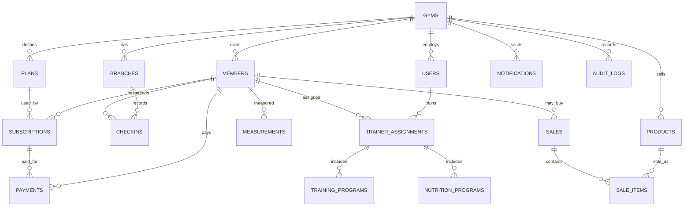

# Gym Management System - System Analysis & Architecture

## 1. Project Vision

Gym Management System is a professional Arabic-first management system for bodybuilding and fitness gyms. The first version should serve one gym reliably, while the architecture must be ready to evolve into a SaaS platform that hosts multiple gyms, branches, employees, trainers, members, payments, products, attendance gates, notifications, and reports.

## 2. Target Users

- Gym owner / manager
- Reception employee
- Accountant
- Trainer
- Financial auditor
- Member
- SaaS platform administrator, future phase

## 3. Current Laravel Project Assessment

The current project already contains a working MVP built with Laravel, Blade, vanilla JavaScript, and Eloquent models.

Current implemented modules:

- Members
- Subscription plans
- Subscriptions
- Payments
- Products
- Sales
- Check-ins
- Body measurements
- Users and Arabic roles
- Activity log
- Dashboard and basic reports
- Smart import

Current architectural style:

```text
Blade Dashboard
-> public/js/app.js
-> /api/{action}
-> GymApiController
-> Eloquent Models
-> Database
```

Main limitations:

- API is action-based instead of resource-based REST.
- No multi-tenant `gyms` or `branches` structure.
- Payments are linked by member name instead of stable foreign keys.
- Subscriptions store `plan_name` instead of `plan_id`.
- Sales store sold products as text instead of normalized sale items.
- Check-in has no checkout time.
- QR/Barcode is not implemented as a dedicated membership credential.
- No trainers, training programs, nutrition programs, or trainer-member assignment.
- No WhatsApp/SMS notification jobs.
- No offline-first synchronization model.
- Authorization is implemented manually in one controller.

## 4. Recommended Architecture

Recommended stack for the current codebase:

- Backend: Laravel 12
- Database: MySQL or MariaDB for production
- Admin database tool: phpMyAdmin
- Frontend first phase: existing Blade + JavaScript improved gradually
- Frontend future phase: React or Next.js
- Mobile app: Flutter or React Native
- Queue: Laravel Queue with Redis or database queue
- Notifications: WhatsApp provider, SMS provider, email provider
- Offline: PWA + IndexedDB + sync queue
- Reporting: Laravel queries first, then materialized/statistical tables if data grows

Layered backend architecture:

```text
Routes
-> Controllers
-> Form Requests
-> Policies
-> Services
-> Repositories / Eloquent Queries
-> Models
-> Database

Events
-> Listeners
-> Jobs
-> Notification Providers
```

Suggested services:

- MemberService
- SubscriptionService
- PaymentService
- AttendanceService
- TrainerService
- MeasurementService
- InventoryService
- SalesService
- NotificationService
- DashboardService
- TenantService
- SyncService

## 5. SaaS Multi-Tenant Strategy

The safest SaaS path is single database with tenant isolation using `gym_id` in every tenant-owned table.

Core tenant tables:

- gyms
- branches
- users
- gym_user
- roles
- permissions
- gym_settings
- saas_plans
- gym_subscriptions
- invoices

Every business table should include:

- `gym_id`
- optionally `branch_id`
- `created_by`
- `updated_by`
- `created_at`
- `updated_at`

Tenant isolation rules:

- Every query must be scoped by the active gym.
- Super admin can access all gyms.
- Gym users can only access assigned gyms.
- Branch users can be restricted to one branch if needed.

## 6. ERD Overview



## 7. Proposed Database Schema

### gyms

- id
- name
- owner_name
- phone
- email
- logo_path
- status: active, suspended, trial
- timezone
- currency
- created_at
- updated_at

### branches

- id
- gym_id
- name
- address
- phone
- is_main
- created_at
- updated_at

### members

- id
- gym_id
- branch_id
- membership_number
- full_name
- phone
- whatsapp
- image_path
- gender
- birth_date
- notes
- status: active, inactive, blocked
- created_at
- updated_at

### membership_cards

- id
- gym_id
- member_id
- code
- type: qr, barcode, rfid
- status: active, revoked
- issued_at
- revoked_at

### plans

- id
- gym_id
- name
- description
- price
- duration_days
- allowed_freeze_days
- is_vip
- status
- created_at
- updated_at

### subscriptions

- id
- gym_id
- member_id
- plan_id
- start_date
- end_date
- amount
- paid_amount
- remaining_amount
- status: active, expired, frozen, cancelled
- frozen_from
- frozen_until
- created_by
- created_at
- updated_at

### payments

- id
- gym_id
- member_id
- subscription_id
- sale_id
- receipt_number
- amount
- method: cash, card, bank_transfer, wallet
- paid_at
- note
- created_by
- created_at
- updated_at

### checkins

- id
- gym_id
- branch_id
- member_id
- subscription_id
- checkin_at
- checkout_at
- source: manual, qr, barcode, mobile
- status: allowed, denied
- denial_reason
- created_by
- created_at
- updated_at

### trainers

Can be represented by users with role `trainer`, plus trainer profile:

- id
- gym_id
- user_id
- specialty
- bio
- commission_rate
- status
- created_at
- updated_at

### trainer_assignments

- id
- gym_id
- trainer_id
- member_id
- start_date
- end_date
- status
- note

### training_programs

- id
- gym_id
- trainer_assignment_id
- title
- goal
- content_json
- start_date
- end_date
- status

### nutrition_programs

- id
- gym_id
- trainer_assignment_id
- title
- calories_target
- protein_target
- carbs_target
- fats_target
- content_json
- status

### measurements

- id
- gym_id
- member_id
- weight
- height
- fat_percentage
- muscle_mass
- waist
- chest
- arms
- measured_at
- created_by

### products

- id
- gym_id
- name
- sku
- barcode
- price
- cost
- stock
- low_stock_threshold
- status

### inventory_movements

- id
- gym_id
- product_id
- type: purchase, sale, adjustment, return
- quantity
- unit_cost
- note
- created_by
- created_at

### sales

- id
- gym_id
- member_id
- invoice_number
- total
- payment_method
- sold_at
- created_by

### sale_items

- id
- gym_id
- sale_id
- product_id
- quantity
- unit_price
- total

### notifications

- id
- gym_id
- member_id
- channel: whatsapp, sms, email, in_app
- type
- title
- body
- status: pending, sent, failed
- scheduled_at
- sent_at
- provider_response

### audit_logs

- id
- gym_id
- user_id
- action
- entity_type
- entity_id
- old_values
- new_values
- ip_address
- user_agent
- created_at

### sync_events

- id
- gym_id
- client_id
- entity_type
- entity_id
- operation
- payload_json
- status: pending, synced, conflict, failed
- occurred_at
- synced_at

## 8. Use Cases

### Member Management

- Reception creates a new member.
- System generates a membership number.
- System generates a QR/Barcode card.
- Reception uploads member image.
- Manager views member profile and history.

### Subscription Management

- Accountant or reception selects member and plan.
- System calculates end date automatically.
- User records full or partial payment.
- System creates subscription and payment receipt.
- System marks unpaid balance as debt.

### Attendance Gate

- Reception scans QR/Barcode.
- System loads member profile.
- System checks active subscription.
- If active, check-in is recorded.
- If expired, entry is denied and renewal prompt appears.
- Optional checkout is recorded later.

### Notifications

- On subscription creation, system sends welcome/confirmation message.
- 3 days before expiry, system queues reminder.
- On expiry day, system queues final reminder.
- After expiry, system queues renewal message.
- If no attendance for configured days, system sends absence message.

### Payments and Debts

- Accountant records payment.
- Payment can be linked to subscription or product sale.
- Receipt number is generated.
- Remaining subscription balance is recalculated.
- Reports show total paid and debt.

### Trainers

- Manager assigns trainer to member.
- Trainer creates training program.
- Trainer creates nutrition program.
- Trainer records progress notes and measurements.

### Products and POS

- Accountant adds products.
- Reception sells products.
- System decreases stock.
- System creates sale invoice and payment record.
- Low stock alert appears.

## 9. Workflows

### New Member + Subscription

```text
Create member
-> Generate membership number
-> Generate QR/Barcode
-> Select plan
-> Calculate dates
-> Record payment
-> Create subscription
-> Create receipt
-> Queue welcome notification
```

### QR Attendance

```text
Scan code
-> Find active card
-> Load member
-> Find active subscription
-> Validate status and date
-> Record check-in
-> Show reception screen
```

### Subscription Expiry Notification

```text
Scheduled job runs daily
-> Find subscriptions ending in 3 days
-> Queue WhatsApp/SMS
-> Find subscriptions ending today
-> Queue WhatsApp/SMS
-> Find expired subscriptions
-> Queue renewal message
```

### Offline Sync

```text
User action offline
-> Store operation in IndexedDB
-> Update local UI optimistically
-> Internet returns
-> Push sync events to API
-> Server validates and applies
-> Server returns conflicts if any
-> Client resolves and refreshes state
```

## 10. API Structure

Authentication:

- POST `/api/auth/login`
- POST `/api/auth/logout`
- GET `/api/auth/me`

Dashboard:

- GET `/api/dashboard/summary`
- GET `/api/dashboard/revenue`
- GET `/api/dashboard/attendance-peak-hours`

Members:

- GET `/api/members`
- POST `/api/members`
- GET `/api/members/{member}`
- PUT `/api/members/{member}`
- DELETE `/api/members/{member}`
- GET `/api/members/{member}/profile`
- POST `/api/members/{member}/card`

Plans:

- GET `/api/plans`
- POST `/api/plans`
- PUT `/api/plans/{plan}`
- DELETE `/api/plans/{plan}`

Subscriptions:

- GET `/api/subscriptions`
- POST `/api/subscriptions`
- PUT `/api/subscriptions/{subscription}`
- POST `/api/subscriptions/{subscription}/freeze`
- POST `/api/subscriptions/{subscription}/unfreeze`
- POST `/api/subscriptions/{subscription}/cancel`

Attendance:

- POST `/api/checkins`
- POST `/api/checkins/scan`
- POST `/api/checkins/{checkin}/checkout`
- GET `/api/checkins`

Payments:

- GET `/api/payments`
- POST `/api/payments`
- GET `/api/payments/{payment}/receipt`

Trainers:

- GET `/api/trainers`
- POST `/api/trainers`
- POST `/api/trainer-assignments`
- POST `/api/training-programs`
- POST `/api/nutrition-programs`

Measurements:

- GET `/api/members/{member}/measurements`
- POST `/api/members/{member}/measurements`

Products and sales:

- GET `/api/products`
- POST `/api/products`
- POST `/api/sales`
- GET `/api/sales`

Notifications:

- GET `/api/notifications`
- POST `/api/notifications/send`
- POST `/api/notifications/templates`

Sync:

- POST `/api/sync/push`
- GET `/api/sync/pull`
- GET `/api/sync/status`

## 11. Permissions Matrix

| Module | Manager | Accountant | Reception | Trainer | Auditor | Member |
| --- | --- | --- | --- | --- | --- | --- |
| Dashboard | Full | Finance | Operational | Own trainees | Read | Own |
| Members | Full | Read | Create/Edit | Assigned only | Read | Own |
| Subscriptions | Full | Full | Create/Renew | Read assigned | Read | Own |
| Payments | Full | Full | Limited create | None | Read | Own |
| Attendance | Full | Read | Full | Assigned read | Read | Own |
| Trainers | Full | None | Read | Own | Read | Assigned |
| Measurements | Full | Read | Create | Full assigned | Read | Own |
| Products | Full | Full | Sell | None | Read | None |
| Reports | Full | Finance | Operational | Assigned | Read | Own |
| Users | Full | None | None | None | None | None |
| Settings | Full | None | None | None | Read | None |

## 12. Financial Analysis

Expected revenue streams for the gym using the system:

- Membership subscriptions
- VIP memberships
- Personal training
- Nutrition plans
- Product and supplement sales
- Late debt collection
- Renewal campaigns

Expected SaaS revenue streams for the software owner:

- Monthly subscription per gym
- Branch-based pricing
- SMS/WhatsApp message package margin
- Premium analytics
- Mobile app add-on
- Multi-branch enterprise package

Suggested SaaS pricing:

- Starter: one branch, limited users, basic reports
- Pro: multiple users, WhatsApp/SMS, inventory, trainer module
- Business: multi-branch, advanced reports, offline sync
- Enterprise: custom integrations, API access, priority support

Core KPIs:

- Monthly recurring revenue
- New members
- Active members
- Expired subscriptions
- Renewal rate
- Average revenue per member
- Attendance frequency
- Peak hours
- Product gross margin
- Outstanding debt

## 13. UI Design Direction

Arabic-first interface:

- RTL layout
- Clear dashboard cards
- Fast member search
- QR scan screen for reception
- Member profile timeline
- Subscription status badges
- Debt indicators
- Trainer workspace
- POS product grid
- Dark mode
- Responsive layouts

Important screens:

- Login
- Main dashboard
- Reception gate
- Members list
- Member profile
- Subscription creation
- Payments and receipts
- Products/POS
- Trainer dashboard
- Reports
- Settings
- SaaS super admin dashboard

## 14. Competitive Features

- Smart QR/RFID gate control
- WhatsApp renewal automation
- No-show alerts
- Member risk score for churn prediction
- Trainer performance metrics
- Member progress charts
- POS and inventory in the same system
- Debt tracking and collection reminders
- Offline mode for unreliable internet
- Arabic-first professional UI
- Multi-branch readiness
- Mobile member portal

## 15. Recommended Implementation Roadmap

### Phase 1: Stabilize Current Laravel MVP

- Convert unstable name-based relations to foreign keys.
- Add `plan_id` to subscriptions.
- Add `member_id` and `subscription_id` to payments.
- Normalize sales into `sales` and `sale_items`.
- Add checkout support to checkins.
- Fix role typo issues and centralize permission checks.

### Phase 2: QR and Reception Gate

- Add membership cards table.
- Generate QR code per member.
- Add scan endpoint.
- Build reception gate screen with image and status.

### Phase 3: Trainers and Measurements

- Add trainer profiles.
- Add trainer-member assignments.
- Add training programs.
- Add nutrition programs.
- Improve measurement charts.

### Phase 4: Notifications

- Add notification templates.
- Add scheduled jobs.
- Integrate WhatsApp/SMS provider.
- Add notification log.

### Phase 5: Reports

- Revenue reports.
- Debts reports.
- Attendance heatmap.
- Renewal rate.
- Product sales and stock reports.
- Trainer reports.

### Phase 6: Offline Mode

- Convert frontend to PWA.
- Add IndexedDB local cache.
- Add sync queue.
- Add server sync endpoints.
- Add conflict handling.

### Phase 7: SaaS Conversion

- Add gyms and branches.
- Add tenant scoping.
- Add SaaS billing.
- Add super admin panel.
- Add tenant settings and branding.

## 16. First Practical Code Step

The first implementation step should be a database normalization migration that keeps existing data safe while adding future-ready fields:

- Add `plan_id` to subscriptions.
- Add `member_id` and `subscription_id` to payments.
- Add `checkout_at`, `source`, `status`, `denial_reason` to checkins.
- Add `membership_number`, `birth_date`, `notes`, `status` to members.
- Create `membership_cards`.
- Create `sale_items`.

After that, update the models and controller methods gradually without breaking the current dashboard.
